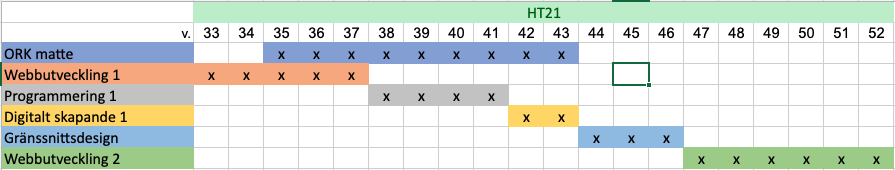

# Klass repo för Webbutvecklare WEB-2108

## Innehållsförteckning

- [Information](#information)
- [Kurser](#kurser)
- [Kursplanering](#kursplanering)

# Information

Material kommer löpande att läggas till löpande

# Kurser

- [Webbutveckling 1](webbutveckling_1)

# Kursplanering

| Kurs                | Start datum | Slutdatum  | Projektuppgift inlämningsdatum |
| ------------------- | :---------: | :--------: | :----------------------------: |
| ORK Matte           | 2021-08-30  | 2021-10-29 | - |
| Webbutveckling 1    | 2021-08-23  | 2021-09-17 | 2021-09-19, 23:59 |
| Programmering 1     | 2021-09-20  | 2021-10-15 | 2021-10-15 |
| Digitalt skapande 1 | 2021-10-18  | 2021-10-29 | 2021-10-29 |
| Gränssnittsdesign   | 2021-11-01  | 2021-11-19 | 2021-11-19 | 
| Webbutveckling 2    | 2021-11-22  | 2021-12-31 | 2021-12-31 |
