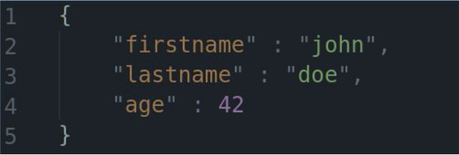
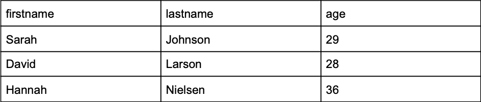

# Övningar, MongoDB

Några övningar för att få bättre förståelse för MongoDB.

Med detta dokument följer följande filer:

1. mongo-lathund.pdf
2. apartments.json

Använd gärna lathunden om du kör fast.

[Här är en bra länk för att se motsvarande SQL kommandon i MongoDB](https://docs.mongodb.com/manual/reference/sql-comparison/#examples)

## Del 1

Skapa en databas med valfritt namn. *command:* `use yourdbname` Lägg in ett objekt i en collection som heter “people”,
detta objekt ska se ut så här:

Kom ihåg, collections behöver man inte skapa manuellt. De skapas per automatik när du stoppar in dokument.

## Del 2

Nu vill vi fylla på vår “people” collection med mer personer. Dessa personer ska in:

(i json format så klart)
Fundera, hur kan du stoppa in flera dokument samtidigt?  
[Läs mer här](​https://docs.mongodb.com/manual/tutorial/query-documents/)

## Del 3

Hannahs ålder är inkorrekt, hon är egentligen 35. Uppdatera hennes dokument i databasen.  
[Läs hur man uppdaterar dokument här](https://docs.mongodb.com/manual/tutorial/update-documents/)

## Del 4

Skriv en fråga som hämtar alla personer vars ålder är över 28. I SQL hade en sån fråga sett ut så här:
`SELECT * FROM people WHERE age > 28;`

Fundera, hur gör man in MongoDB?

Hint: `$gt` operatorn skall användas.  
[Länk](https://docs.mongodb.com/manual/reference/operator/query/gt/)

## Del 5

Skriv en fråga som hämtar alla personer vars ålder är *lika med eller* över 28. I SQL hade en sån fråga sett ut så här:

`SELECT * FROM people WHERE age >= 28;`

Fundera, hur gör man in MongoDB?

Hint: `$gte` operatorn skall användas.  
[Länk](https://docs.mongodb.com/manual/reference/operator/query/gte/)

## Del 6

Med det här dokumentet följer en JSON fil med, den heter `apartments.json`.

Importera den in till din MongoDB databas.

`mongoimport --db dbName --collection apartments --file apartments.json --jsonArray`

## Del 7

Hur kan du få ut hur många dokument det finns i din “apartments” collection nu?

Prova!

[Här kan du läsa om hur man gör](https://docs.mongodb.com/manual/reference/method/db.collection.countDocuments/)

## Del 8

I din `apartments` collection finns det ett dokument vars address är `12018 Moland Center`. 

Skriv en fråga i MongoDB som tar bort detta dokument. 

Det finns flera sätt att göra det på:

https://docs.mongodb.com/manual/tutorial/remove-documents/

https://docs.mongodb.com/manual/reference/method/db.collection.remove/

- Efter du tagit bort detta dokument. 
- Kör nu frågan igen som räknar dokumenten i “apartments”. 
- Är siffran nu lägre? 
- Om siffran inte är lägre så lyckades du inte ta bort ditt dokument.
