# Vad vi ska göra idag.

1. Gå igenom kursplan och examinerande moment
2. Installera programvara 
3. Frågor gällande inlämning i Programmering 1
4. Gå igenom tillgänglig utrustning
5. Liten föreläsning
6. Samla in material att arbeta med vid nästa tillfälle

# Examinerande moment
Inlämningsuppgift eller uppgifter kommer att innefatta: 
* en egen produktion i minst ett format
* redogörelse för minst en av dina skapandeprocesser, från ingenting till slutprodukt
* redogörelse för olika verktyg och deras användning i din skapandeprocess
* motivering för dina val av programvara och hårdvara
* samarbete med andra över webb eller nätverk
* redogörelse för olika presentations- eller spridningsvägar
* ytterligare moment kan tillkomma.

# Termer
### Format
Format i den här kursen syftar på vilken utformning din gestaltning på en idé har.
Exempel på format:
* Foto
* Skiss
* Text
* Rörlig bild
* Ljud
* 3D-animering
* Logotyp
* Style sheet
* Kombination av flera format 

*...det är alltså inte filformat i detta fallet*

### Gestaltning

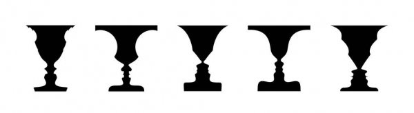

Gestaltning innebär att förmedla en eller flera idéer till någon annan.

*”att ge något en form och en mening genom att visa upp det”* - [Källa](https://oppetklassrum.wordpress.com/att-gestalta-anvanda-verb/)

Kommer från tyskans "Gestaltung" som kan betyda "kreativ skapandeprocess"

### Skapandeprocessen
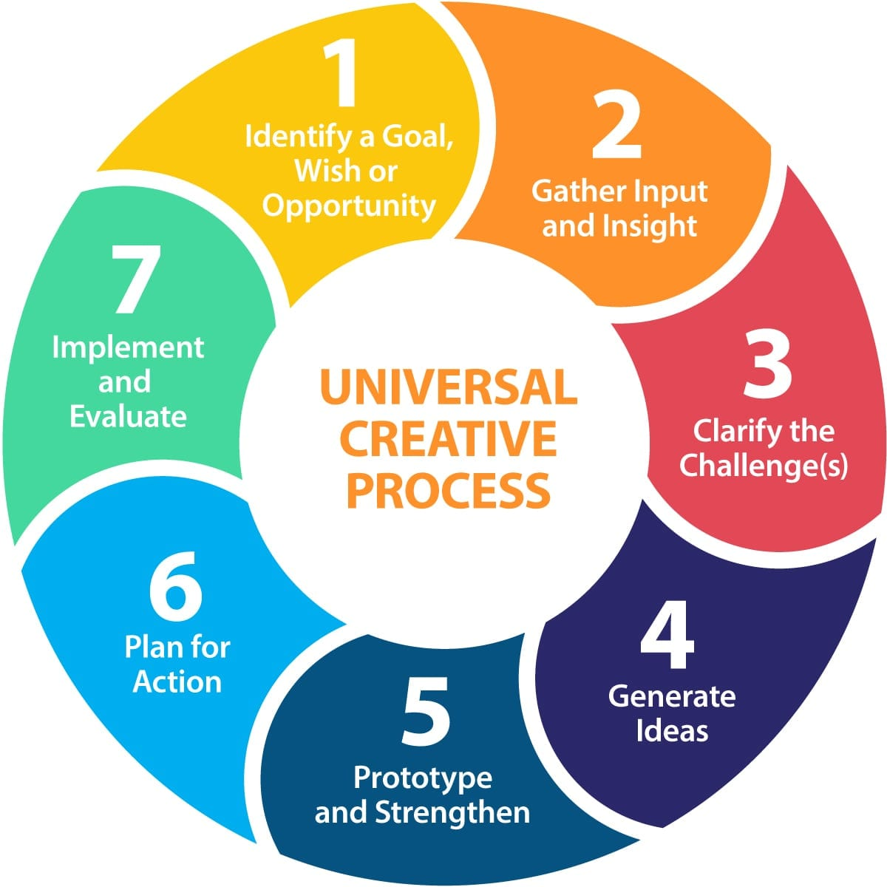
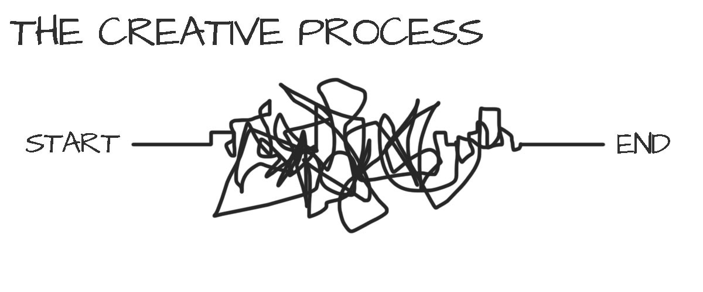
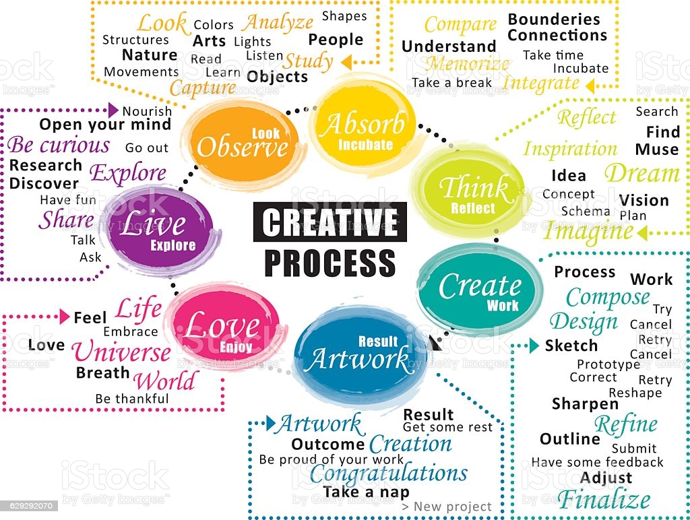
Den kreativa processen som leder fram till ett resultat

### Medium

*"Ett medium är något som kan lagra, förmedla eller överföra information."*

*"Bild, text, tal och ljud är de vanligaste verktygen vid förmedling via medierna och dessa engagerar enbart synsinnet och hörseln."* - [Källa](https://sv.wikipedia.org/wiki/Medium)

# Relevans för webutvecklare
### Iterativ processmodell
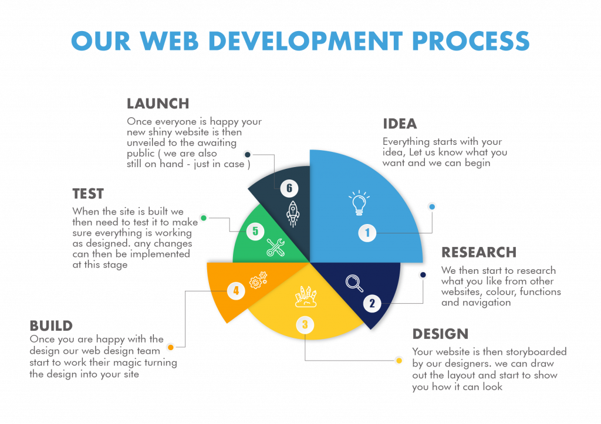
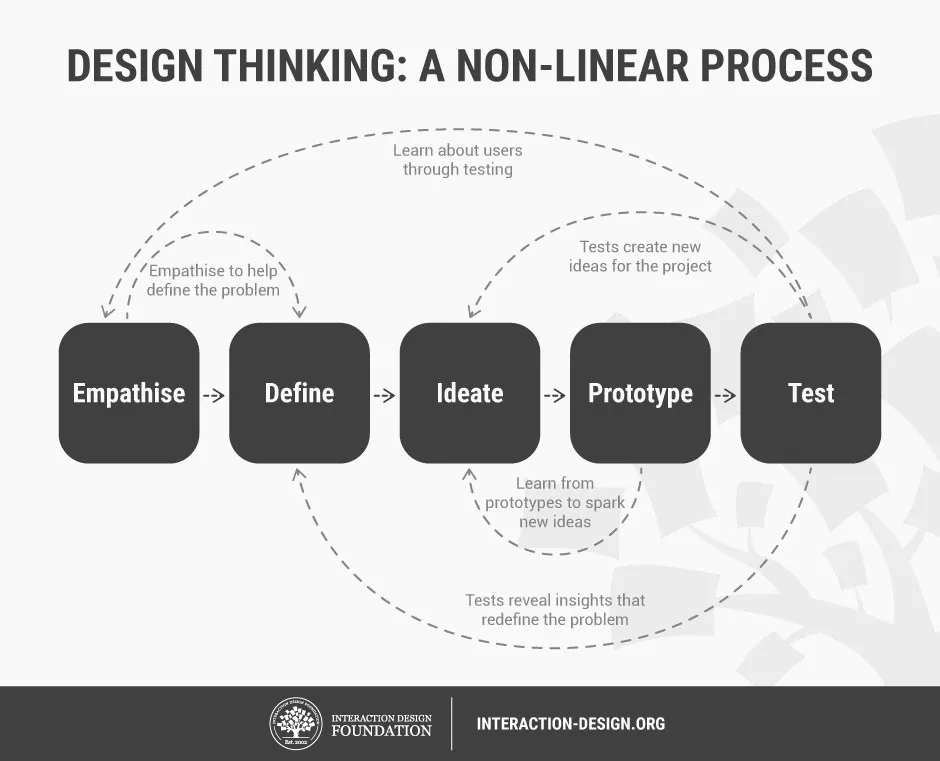
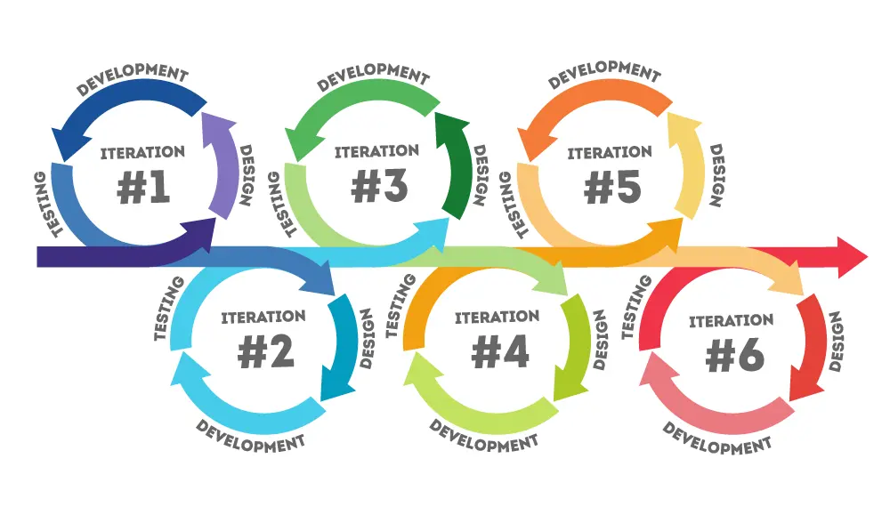
### Vattenfallsmetoden
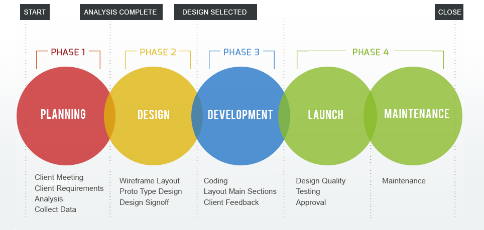
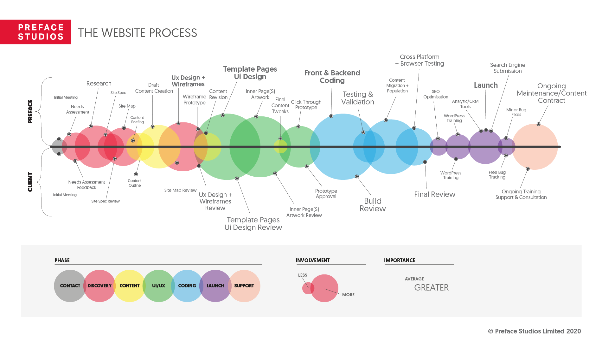
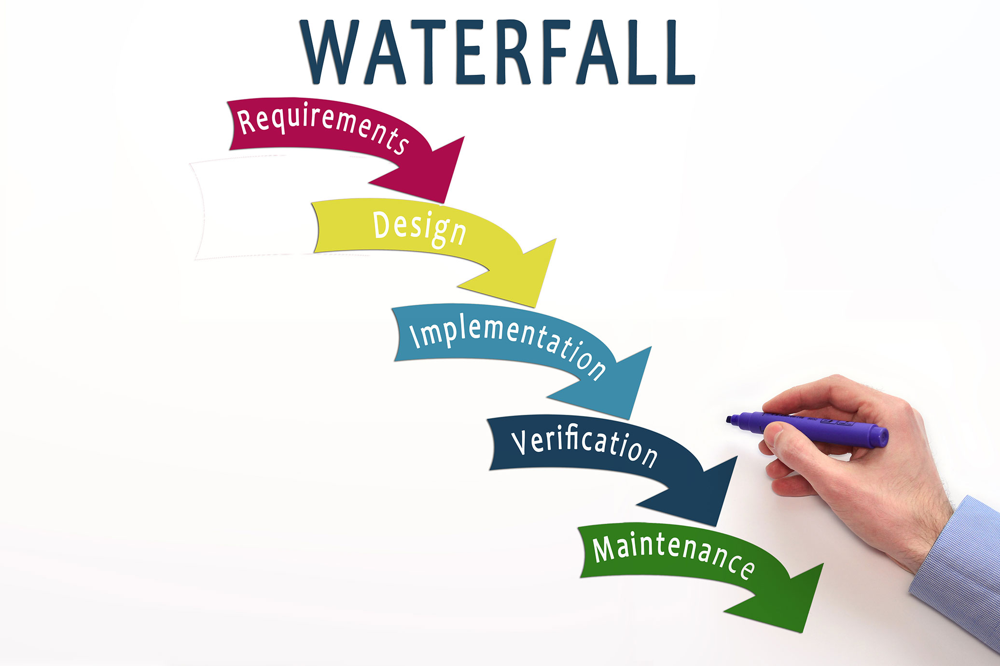
### Profitmodellen
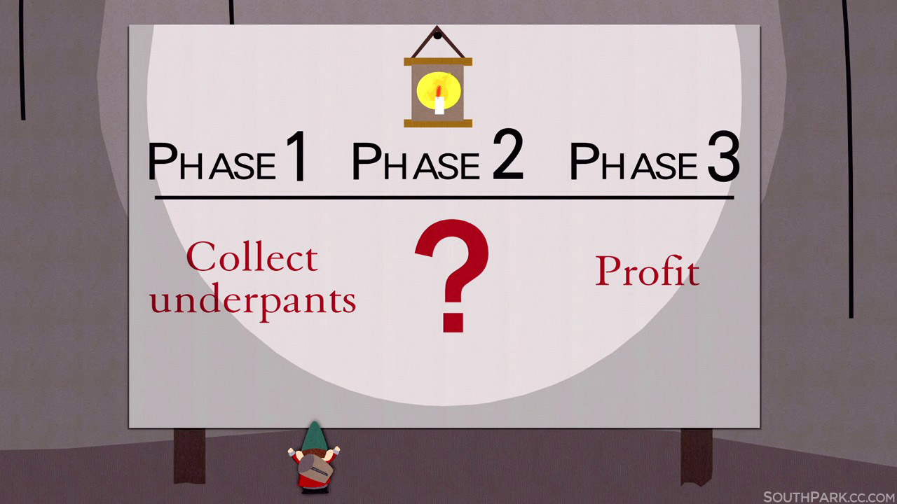

## Mood Board
[How to mood board for Web Designer](https://www.youtube.com/watch?v=1A-tepzfhJw)
* [Figma](https://www.figma.com/)

## Bildredigeringprogram
* [GIMP 2.10.28](https://www.gimp.org/downloads/)
  * [Udemy](https://www.udemy.com/course/gimp-crash-course/)
  * [Inspiration - U suck at at photoshop](https://www.youtube.com/watch?v=U_X5uR7VC4M&list=PLD19BCF9D57320E03)
  * [Frlägg motiv i GIMP](https://www.youtube.com/watch?v=506SzACpANA)
### Plugins till GIMP
* [G'MIC Latest dev](https://gmic.eu/download.html)
* [Darktable](https://www.youtube.com/watch?v=iI0azg37MPs)

## Vectorgrafik
Skissa en logga för hand och gör om till vector
* [Inkscape](https://inkscape.org/release/inkscape-1.1.1/)
  * [Inkscape Tutorial: Vector Image Trace](https://www.youtube.com/watch?v=s-kPg4vYKfk)

## Ljudbearbetning
* [Reaper](https://www.reaper.fm/download.php)
  * [Reaper for podcasting](https://www.youtube.com/watch?v=CPeUilYS4rc)
* [Audacity](https://www.audacityteam.org/download/)

# Videoredigering
* [Shotcut](https://shotcut.org/download/)
  * [Udemy](https://www.udemy.com/course/video-photo-edit-montage-mastery/)
  * [Inspiration - Lasse Gjertsen Hyperactive](https://www.youtube.com/watch?v=o9698TqtY4A)
  * [Inspiration - Lasse Gjertsen Amateur](https://www.youtube.com/watch?v=JzqumbhfxRo)

