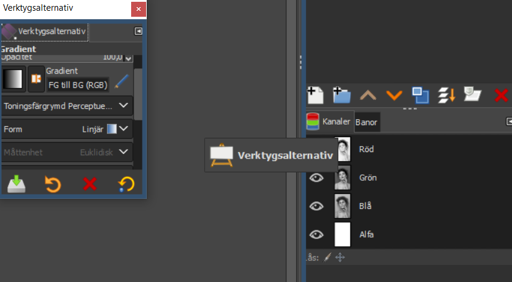
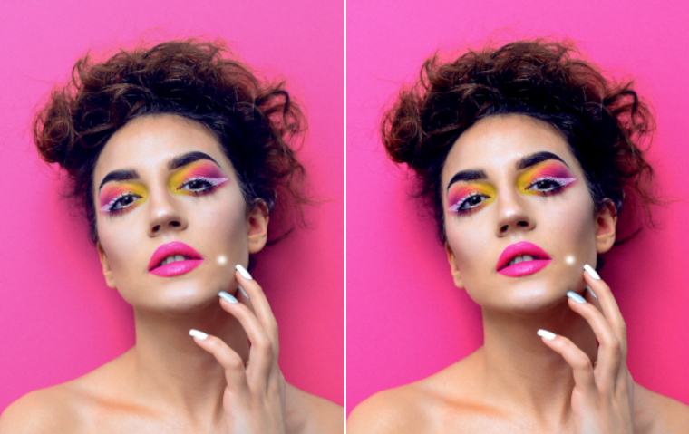
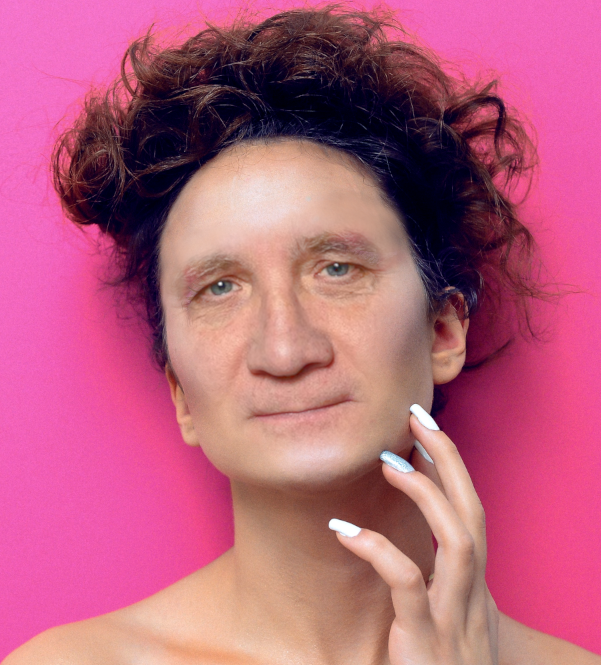

* [Presentation hur man får bra idéer](https://docs.google.com/presentation/d/1tT8p_0r0Iw8IzRYAN7-Eb_AVo789755nBB4MJvAnRl0/edit#slide=id.gff27498_0_103)

# GIMP Introduktion till fotoredigering

## Inställningar

1. Verktygsstorlek
2. Visning av verktyg
3. Färgtema för verktyg
4. Språk
5. Flikar

## Viktiga Flikar

1. Lager
2. Verktygsalternativ
3. Penslar
4. Ångringshistorik

## Skapa nytt projekt
1. Välj bildstorlek och ppi (punkter per tum)
   1. 300 ppi för tryck och 72 ppi för web
2. Använd mallarna, det går att ändra i efterhand

## Öppna bild
1. Under arkiv väljer du open och letar upp bilden du vill jobba med. 

## Ångra
När vi spelar dataspel så håller vi vänsterhanden över WASD tangenterna.

När vi redigerar någonting har vi vänsterhanden över CTRL och Z.

CTRL + Z ångrar det sista vi gjorde, trycker vi flera gånger så backar vi flera steg.

CTRL + Y gör om det vi ångrat, trycker vi flera gånger så går vi fram flera steg.

Vi kan också få upp Ångringshistoriken under Redigera

## Lager

Fotoredigeringsprogram tittar från det översta lagret och ner, som en overhead.

Vi kan stänga av lager genom att trycka på ögat

Opacitet är standard 100% vilket betyder att inget ljus släpps igenom bilden.

För att duplicera (klona) ett lager högerklickar vi på bilden och väljer duplicera.

## Alphakanal

För att få transparent (genomskinlig) bakgrund behöver vi ibland lägga till en alphakanal i GIMP.

Detta är om vi klipper in jpeg, eller andra format, som saknar transparensinformation.

Vi gör detta genom att högerklicka på lagret och välja lägg till alphakanal.

# Omorganisera flikar
Det går att flytta runt flikar dit vi vill ha dem genom att ta tag och dra i fliken.

# Making it pop
 
*Bild finns i mappen img på github och heter makeitPop2.png*
## Nivåer
1. Börja med att göra en kopia av lagret så att vi har orginalet kvar att jämföra med
2. Under färger kan du hitta nivåer
3. Dra mätaren längst till vänster lite till höger, till där grafen börjar
4. Dra mätaren längst till höger lite till vänster
5. Nu ska din bild få lite klarare färger, bättre färgdynamik

# ASCII Art
1. Välj nu G'MIC längst ner under Filter
2. Ett nytt fönster öppnas där vi kan se kategorier av filter
3. ASCII filtret finns i Arrays & Tiles
4. Här kan du ändra charset till t.ex. binary
5. Du kan också göra Result type till COlored on Transparent så att det blir ett overlay till baslagret.
6. När du trycker på ok görs lagret du valde att jobba med om till filtrets inställningar.

# Lägg till ett annat ansikte

1. Öppna en ny fil med ansiktet du vill klippa in
2. Välj Lassoverktyget/Fri Markering (F) och markera ansiktet, ögon, näsa och mun
3. Kopiera till urklipp det du har markerat med CTRL + C
4. Välj flyttningsverktyget (M) för att gå ut ur Lassot
5. Gå till originalbilden och klistra in från urklipp med CTRL + V
6. Ändra storlek så att den passar hyfsat
   1. Du kan ändra storlek antingen med Skalningsverktyget (Shift + S)
      1. Håller vi ner CTRL när vi skalar så bibehålls bildens X och Y förhållande
   2. Eller genom att högerklicka på lagret och välja "Skala lager" och skriva in värden manuellt
      2. Se till att länkikonen är länkad så behöver du bara ändra ett värde så ändras det andra automatiskt
7. Dra ner opaciteten på ditt nya lager så att du kan matcha in ögon och mun
   1. Ändra storlek så att det blir rätt förhållande
8. Nu kan du höja opaciteten på lagret till 100%
9. Välj suddigummiverktyget
10. Välj fliken penslar och välj penseln med den lägsta hårdheten (0.25)
11. Öppna fliken verktygsinställningar 
    1. Du ser hur stort suddigum du användet genom att hålla markören över bilden'
    2. Ändra till ett relativt stort suddigum
12. Sudda längs med kanterna för så att din bild smälter in bättre med bakgrundsansiktet.
13. Det finns olika verktyg under Färger som du kan använda för att matcha färgen i ansiktet så att de passar bättre
    1. Nivåer
    2. Kurvor
    3. Mättnad
    4. Exponering
    5. Nyans-Mättnad
14. Om det syns detaljer från bilden bakom så kan du använda dig av kloningsverktyget (C)
    1. HÅll nere CTRL och klicka på en yta där du ska klona ifrån, oftas rakt ovanifrån
    2. klicka sedan där du vill täcka över
    3. Byt ställe som du klonar ifrån ofta, eller dra med kloningsverktyget
15. Gör små förändringar på alla steg ovan tills du är nöjd
17. Et Voila!

# Eget arbete för dagen
VI tog bilder på par i klassen i tisdags, nu ska vi byta ansikten på bilden.

Lättast är om du öppnar bilden du tog två gånger i GIMP.

En som är ditt canvas och en där du klipper ifrån, detta är för att lagrena beter sig om man klipper från samma bild.

Byt sedan ansikte på de två klasskamraterna på bilden.

Om du behöver spegelvända ansiktet för att det bättre ska passa så finns det ett vändverktyg (Shift + F)

Använd instruktionerna ovan så gott du kan och fråga om det är något du behöver hjälp med.

Experimentera gärna med G'MIC filrena

Du får utforska programmet så mycket du vill, klicka och testa allt du hittar.

Skapandet är en trial and error process om något.

Gör gärna några stycken bilder och publicera resultaten på Discord.