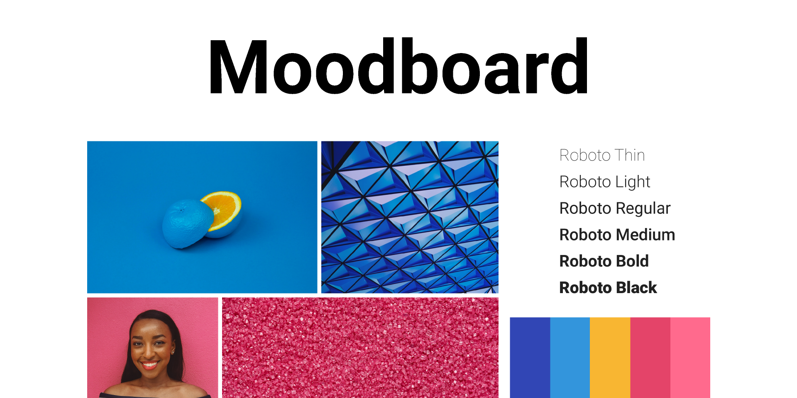
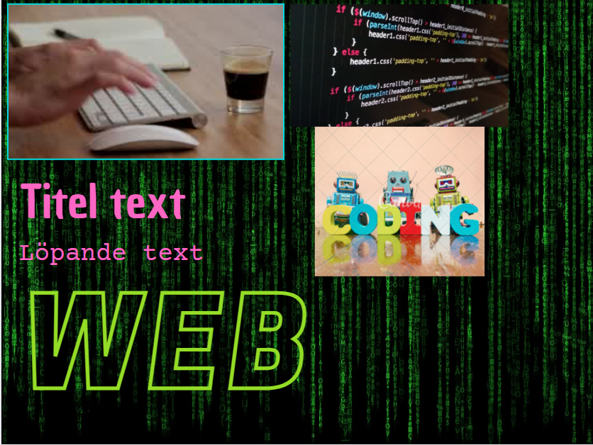
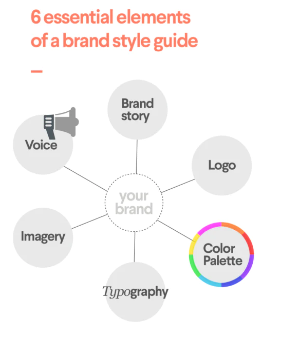
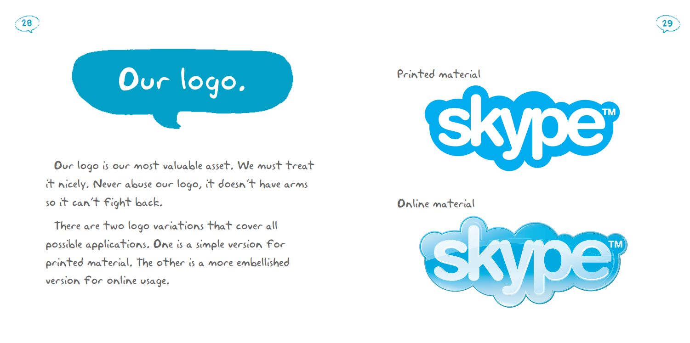
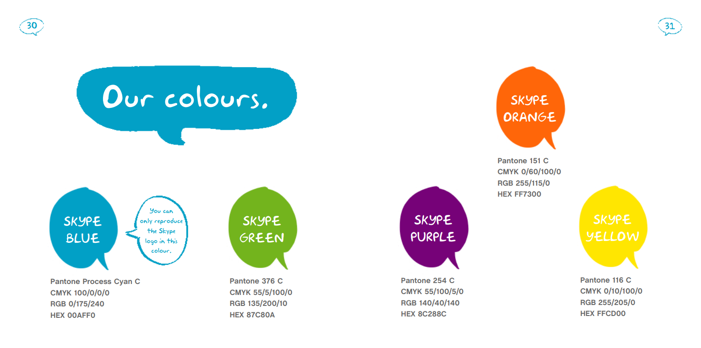
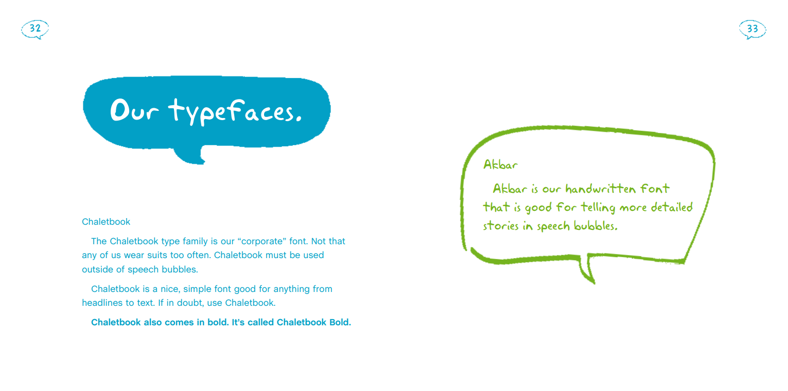
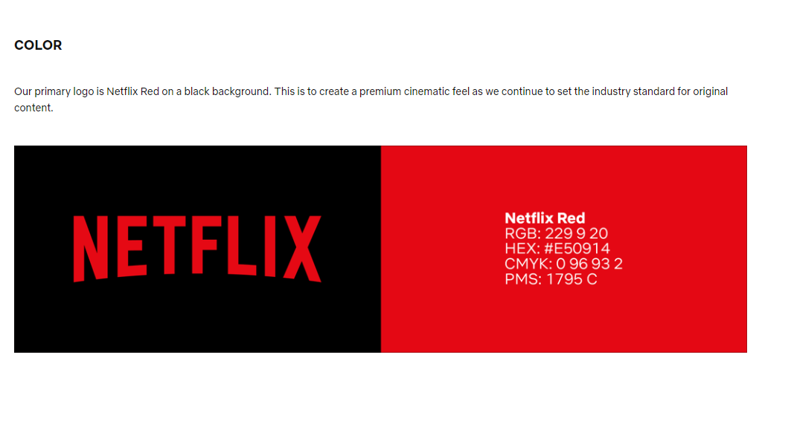
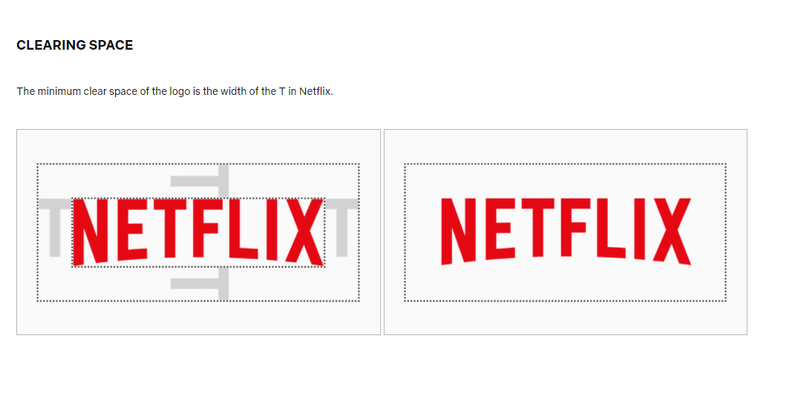
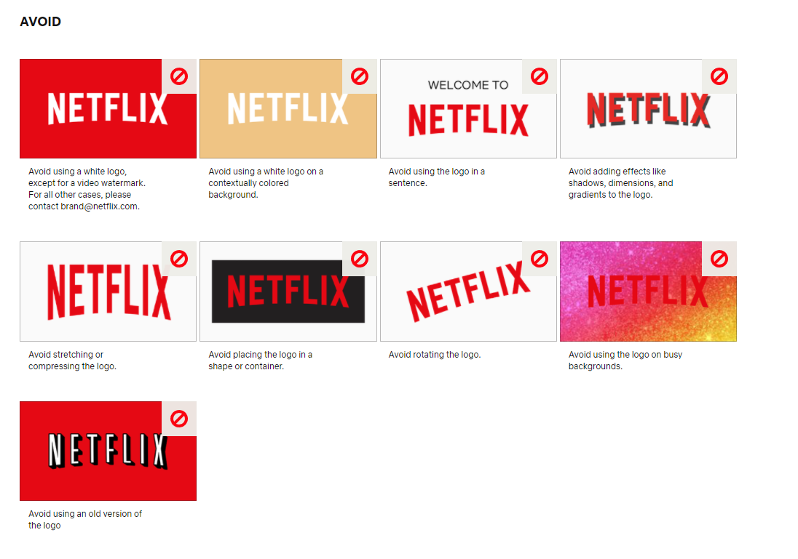
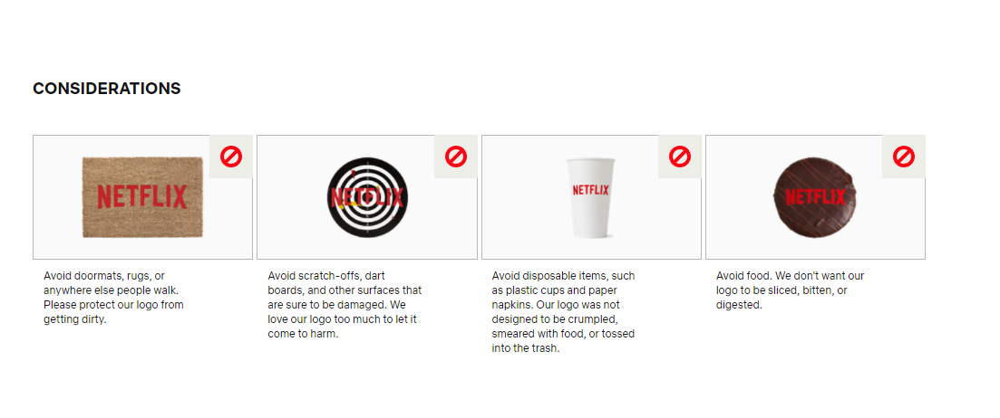

 
 
 
 
 
 

# “The enemy of art is the absence of limitations.” 
#### - Orson Welles

---

---
# Mood board / Inspiration board

* Ett digitalt (eller fysiskt) kollage av idéer
* Ett effektivt sätt att ta sig från idé till att komma igång med utkast
* Finns många färdiga templates att utgå ifrån
* Oftast rent visuell

### Varför Moodboard?
* Bra sätt att skapa en helthetssyn från start
* Förtydligar visionen
* Underlättar samarbete
* Lätt att visa upp för kunder i tidigt skede

---

## Exempel på populära appar:
* Canva
  * Gratis i 30 dagar
  * Finns fonts, ljud, video och bilder i mängder
* Milanote
  * Lite mer avancerat
  * Färdiga mallar
* Pinterest
  * Finns väldigt många exempel att inspireras av
* Figma
  * Mer avancerat än de andra
  * Väldigt användbart för webdesign

---

---

---

# Brand Style Guide
* En regelbok för hur en organisation ska presentera sig själv för världen
* Ska uttrycka företagets personlighet

---
## Vad vill man ha en style guide?
* Logotyp, typsnitt, färger och det visuella kan vi definiera med t.ex. moodboard
* Hjälper oss att begränsa designvalen vi behöver göra
* Värdefullt att ha ett dokument som ger regler till alla involverade i ett projekt
* Minimerar konflikter angående designbeslut, style guiden har alltid rätt
* Minimerar antalet tolkningar över hur saker ska göras
* Effektiviserar arbetet med utformandet av produktioner

---

---

---

---

---

---

---
 

---

---

# Länkar

[Skapa moodboards - Canva](https://www.canva.com/sv_se/skapa/moodboard/)

[Color Wheel](https://www.canva.com/colors/color-wheel/)

[Pinterest](https://www.pinterest.se/)

[Figma](https://www.figma.com/)

[Milanote](https://milanote.com/)

[Style Guides](https://keap.com/business-success-blog/marketing/branding/a-simple-brand-style-guide)
