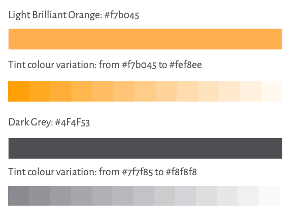

# Gränssnittsdesign

## Lektion 2021-12-13

- Introduktion till UX Design (User Experience)
- UX Koncept och terminologi
- Användargränssnittet UI
- Human-Computer Interaction HCI
- Interaktions design
- Innehålls strategi
- Informationsarkitektur
- Användbarhetstestning

## Style guide

## Steg:

1. Skapa react projekt med `npx create-react-app react-intro-style` som namn 
2. `cd react-intro-style`
3. `npm start`
4. Rensa bort onödigt
5. Skapa projektstruktur
6. Skaffa fonter från google fonts:
    - Alegreya Sans - Regular
    - Oleo Script - Regular
7. Skapa en global.css i foldern `utils/global/css/`
8. Implementera Font samt färger efter stil-guiden
9. Gör en navbar och följ färgschemat
10. Gör en footer och följ färgschemat
11. 
12. 
13. 
14. 
15. 
16. 
17. 

