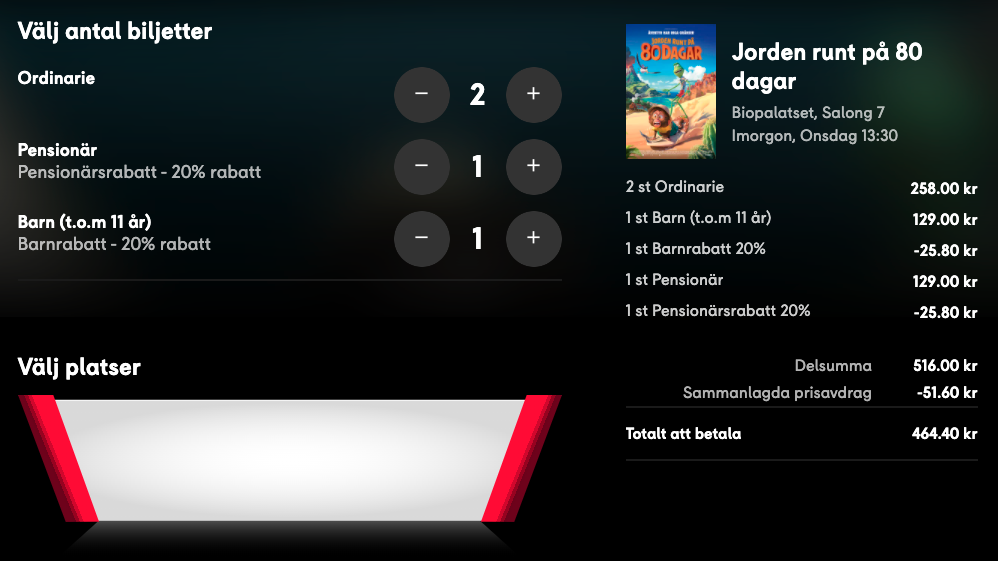

# Kompletteringsuppgift Programmering 1

## Innehåll

- [Inledning](#inledning)
    - [Bakgrund](#bakgrund)
    - [Frågeställningen](#frgestllningen)
    - [Mål](#ml)
    - [Avgränsning](#avgrnsning)
    - [Syfte](#syfte)
    - [Vad ska ni leverera?](#vad-ska-ni-leverera)
- [Projekt Uppgift](#projekt-uppgift)
    - [Lägg till biljetter i kundkorgen](#lgg-till-biljetter-i-kundkorgen)
- [Betygskrav](#betygskrav)
    - [Betyg E](#betyg-e)
- [Sista inlämningstid](#sista-inlmningstid)

# Inledning

## Bakgrund

Ni är nu i slutet på kursen Programmering 1 och av olika anledningar ska ni få en ny uppgift.

## Frågeställningen

Hur kan vi göra en statisk kundkorg som uppdateras.

## Mål

I detta projekt ska ni göra en enkel hemsida baserat på att man vill boka biobiljetter för barn/ordinarie/pensionär.
Man ska kunna uppdatera antalet biljetter samt att om totalsumman är över 500kr, så bjuder vi på en Popcorn.

## Avgränsning

HTML och CSS för det grafiska gränssnittet och Vanilla JavaScript för funktionaliteten. Dvs ingen:

- JQuery
- Media Queries (Frivilligt)
- JavaScript Frameworks

## Syfte

Att ni ska lära er vad JavaScript tillför för funktionalitet samt vilket möjligheter det ger för programutveckling.

## Vad ska ni leverera?

En applikation med en kundkorg, där man ska kunna

- Öka och minska antalet biljetter per kategori
- Visa antalet biljetter man har i kundkorgen
- Visa totalsumman för varje biljettyp
- Visa totalkostnad för besöket
- Visa hur många fria Popcorn man får med i besöket, om totalsumman är under 500kr visa hur långt det är kvar till fri popcorn. 

# Projekt Uppgift

## Lägg till biljetter i kundkorgen

Exempel från filmstaden på hur det kan se ut:

Tänk på att filmstaden har funktioner som ni inte ska ha med och vise versa.

### Funktioner som ska finnas

- När användaren ändrar antalet biljetter så ska alla uträkningar uppdateras med en gång.

- Det ska inte vara möjligt att skriva in felaktiga värden så som negativa värden i "antalet boxarna".

- Om ordern är på mer än 500kr (eller lika med) så ska det ingå en popcorn. Om summan för fri popcorn inte uppnåtts så visa
  hur långt (skillnaden) det är kvar till fri popcorn:

# Betygskrav

Det är funktionaliteten på ert arbete som betygssätts inte hur gränssnittet ser ut. Dock gör det inget om gränssnittet
ser polerat ut då det ger erfarenhet, repetition och kunskaper till nästkommande kurser.

## Betyg E

- Planera lösningsförslag innan uppgiften påbörjas med till exempel:
    - Hur du tänker försöka lösa uppgiften.
    - Pseudokod.
    - Diagram.
    - Trello
- Konsekvent kod stil:
    - Tydlig namngivning av variabler.
    - Strukturerad och enkelt kommenterad källkod med tillfredsställande resultat.
    - **Lättläst kod.**
- Gör en enklare kontroll så att dina funktioner fungerar som de ska.

### Dokumentation

**I en README.md fil!**

Gör en enkel dokumentation på ditt arbete, _till exempel_:

- Beskriv lite olika lösningar du gjort.
- Beskriv något som var besvärligt att få till.
- Beskriv om du fått byta
  lösning och varför i sådana fall.
- Använd korrekta begrepp och syntax i dina beskrivningar.

#### Programmet skall fungera

# Sista inlämningstid

23 Nov kl 23:59
