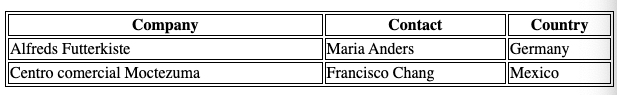

# 2021-09-07

## Dagens lektion

- [Ny HTML](#ny-html)
    - [Tabeller](#tabeller)
- [Ny CSS](#ny-css)
    - [Flexbox CSS](#flexbox-css)
- [Resurser](#resurser)
- [Övningar](#vningar)

## Ny HTML

### Tabeller

Taggar:

- `<table>` - Skapa tabell.
- `<tr>` - Table Row (Tabell Rad)
- `<th>` - Table Header (Tabell titel)
- `<td>` - Table Data (Tabell Cell)

```html

<table>
    <tr>
        <th>Company</th>
        <th>Contact</th>
        <th>Country</th>
    </tr>
    <tr>
        <td>Alfreds Futterkiste</td>
        <td>Maria Anders</td>
        <td>Germany</td>
    </tr>
    <tr>
        <td>Centro comercial Moctezuma</td>
        <td>Francisco Chang</td>
        <td>Mexico</td>
    </tr>
</table>
```



[w3schools](https://www.w3schools.com/html/html_tables.asp)

## Ny CSS

### Flexbox CSS

Länkar till bilder

- `https://static.pexels.com/photos/52500/horse-herd-fog-nature-52500.jpeg`
- `https://static.pexels.com/photos/66898/elephant-cub-tsavo-kenya-66898.jpeg`
- `https://static.pexels.com/photos/213399/pexels-photo-213399.jpeg`
- `https://static.pexels.com/photos/158471/ibis-bird-red-animals-158471.jpeg`
- `https://static.pexels.com/photos/133459/pexels-photo-133459.jpeg`
- `https://static.pexels.com/photos/50988/ape-berber-monkeys-mammal-affchen-50988.jpeg`

## Resurser

- [CSS Browser Support Reference](https://www.w3schools.com/cssref/css3_browsersupport.asp)
- [Can I use](https://caniuse.com/)
- [What CSS to prefix](http://shouldiprefix.com/)
- [Autoprefixer CSS online](https://autoprefixer.github.io/)
- [CSS Transitions and Transforms for Beginners](https://thoughtbot.com/blog/transitions-and-transforms)
- [Introduction to Basic CSS](https://www.freecodecamp.org/learn/responsive-web-design/basic-css/)

## Övningar

- [CSS Selector Game](https://css-diner.netlify.app/)
- Robofriend


