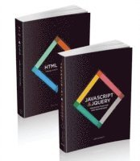

# Webbutveckling 1

## Rekommenderad kurslitteratur
Ej krav!  
  
Namn: Web Design with HTML, CSS, JavaScript and jQuery Set  
ISBN: 9781118907443  
Länk: [Bokus](https://www.bokus.com/bok/9781118907443/web-design-with-html-css-javascript-and-jquery-set/)  
Extra: [Kompendium till boken](http://www.htmlandcssbook.com/code-samples/)

## Installationslänkar

- [Firefox Browser Developer Edition](https://www.mozilla.org/sv-SE/firefox/developer/)
- [Visual Studio Code](https://code.visualstudio.com/)
- [Git](https://git-scm.com/)
    - Gör följande val under installationen:
    - VSCode som **default editor**
    - Klicka i val i slutet för att "Högerklicka för att starta Git Bash i utforskaren"
    - Annars ta rekommenderade/default inställningar
- [GitHub Desktop](https://desktop.github.com/)
    - Logga in på ert konto som ni skapar på GitHub (använd er privata mailadress)
- [Node.js](https://nodejs.org/en/) `Vi går igenom dessa senare`
    - Lägg till/klicka i `tools/chocolatey` när den frågan kommer. 
- [live-server](https://www.npmjs.com/package/live-server) `Vi går igenom dessa senare`

# Skapa konto hos:

- [GitHub](https://github.com/)

# Kursplaning

[Kursöversikt med schema i pdf format](KursoversiktWebbutveckling1.pdf)

[Kursplanering i pdf format](KursplaneringWebbutveckling1.pdf)
